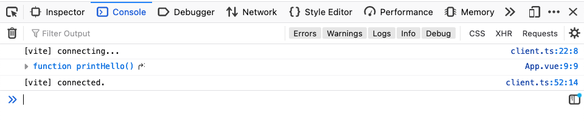
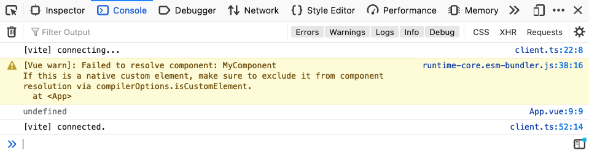

# Vue & @typescript-eslint/consistent-type-imports Bug

## Repro

Clone this repo and run ESLint:

```bash
git clone https://github.com/leonzalion/vue-consistent-type-import-bug
cd vue-consistent-type-import-bug
npm install
npm run lint
```

You should get the following lint error:

```text
  3:1  error  All imports in the declaration are only used as types. Use `import type`  @typescript-eslint/consistent-type-imports

✖ 1 problem (1 error, 0 warnings)
  1 error and 0 warnings potentially fixable with the `--fix` option.
```

When using the Component solely as a type in the &lt;script&gt; section (even though you want to use it in the &lt;template&gt;), TypeScript ESLint's @typescript-eslint/consistent-type-imports rule tries to replace it with an `import type` import, which breaks the import since it's compiled away:

Without `import type`:


With `import type`:

